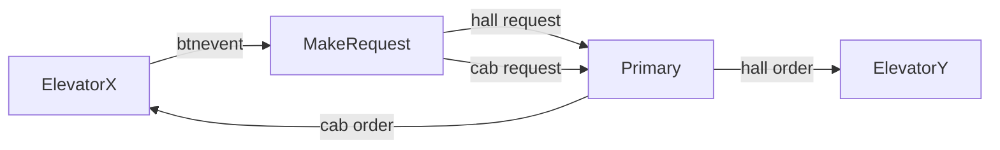

# TTK4145-Sanntid: The Elevators are Evolving!

## Main approach - Primary Backup
The problem: controll N elevators working in parallel across M floors.

The approach: Primary Backup system. All elevators on the network are backups, *only one is primary*. The primary handles and distributes all hall requests and lights. The backups receives worldviews from the primary and stores the latest worldview received. If the primary disconnects, one of the backups will take over as primary. 

## Specifications
- No calls are lost.
- The lights and buttons function as expected.
- The doors function as expected.
- Each individual elevator behaves sensibly and efficiently.
- Multiple elevators are more efficient than a single one

## Initialization of elevator
An elevator can be initialized from the command line with: `go run main.go --port="..." --id="..."`.  
Each elevator must be assigned an unique id at initialization.

# The Button Light Contract
## Requests and Orders
When a button is pressed in any elevator, a corresponding `request` is created. This request is then handled by the primary and an `order` is made. Each order is marked with an `id` and the order is accepted only by the elevator with the corresponding `id`.

If the request is of type `cab`, it is assigned to the elevator who sent the cab request.
If the request is of type `hall`, it is assigned to the most suitable elevator on the network. 
The resulting request/order flow can be seen in the below diagram.

### Request/Order Flow

## When is the light set?
The `cab lights` are handled locally on the elevator. If an elevator recevies a cab order it updates its `order matrix` and sets the corresponding cab light. Likewise, if it completes a cab order, it updates its order matrix and turns off the cab light.

The `hall lights` are handled by the primary. The primary knows that an `order is accepted` when the assigned elevator returns an `elevator state` with the corresponding order set active, i.e with an updated order matrix. With this in mind, the primary uses the order matrices from the elevators to update the hall lights. It does this in a `hall light matrix`, which is essentially a union of all the order matrices. The hall light matrix is then broadcasted to the elevators, who updates their corresponding hall lights.

The Order/Light flow is illustrated in the below figure.
1. Primary sends order to Elevator
2. Elevator sends its updated order matrix to Primary
3. Primary sends updated hall light matrix to elevator 

### Order/Light flow

# Fault tolerance protocol
## Primary Backup
As mentioned, all nodes on the network are backups, *only one is primary*. The backup shadows the communication from the primary to the elevators. This is implemented quite simply by passing all the information from the primary to the elevator via the backup:

This way, we can be sure that all the information that reaches an elevator is backed up by its respective backup. 

## Message types
The Primary receives `elevator state` and `request` and broadcasts `worldviews`.
### Elevator state
### Request
### Worldview

## Primary Takeover
When a backup discovers a primary timeout ...

# Improvements
## Improve obstruction robustness
As per now, when an elevator is obstructed, the primary reassigns its hall orders after `T_OBSTRUCTED_PIRMARY = 3 sec`. The elevator however, waits `T_OBSTRUCTED_LOCAL = 4 sec` before it deletes its hall orders. Alas, there is a time buffer of one second where the primary can reassign the orders before they are deleted. This is not very robust. If the delay between the obstruction event and the primarys detection of it is longer than one second, the active hall orders will be deleted before they are reassigned and thus permanently lost. This is bad. However, the corresponding hall lights will also turn off, and it is reasonable to expect that a client would push the hall button again, thus making a new hall request.

## Reduse number of network ports
As per now, the application uses three ports in stead of two. This is due to a (up until this point not understood) bug where the transmission of worldviews would halt. A bit clumsy, this was fixed (on the surface at least) by broadcasting the worldview on a separate port. The improvement includes fixing this bug, utilizing the router function of the `Transmitter()` and `Receiver()` function from the peers and bcast modules and reduce the number of ports used.

## Reduse the transmission of unecessary overhead  
As the worldview struct grew larger, the transmitter `bufSize` was increased to `4096` bytes instead of the initial `1024` bytes. This increase is probably not necessary. In stead the size of the worldview could be more dynamic, redusing unecessary overhead e.g. like an empty 4 x 4 matrix containing no orders.

# Miscellaneous
## Variable naming convention
As a general rule, camel-case convention is used. Initial capitalization is handled as such: lowercase for localVariables and helperFunctions, uppercase for ExportedVariables and FunctionsUsedElsewhere. Global constants are fully capitalized with underscores between words: PORT_BCAST, NUM_FLOORS, etc.

## Config
The config module holds constants, types and constructor functions that are used in most of the other modules. These are all static; so to increase the overall readability of the code, the config package is dot-imported.
